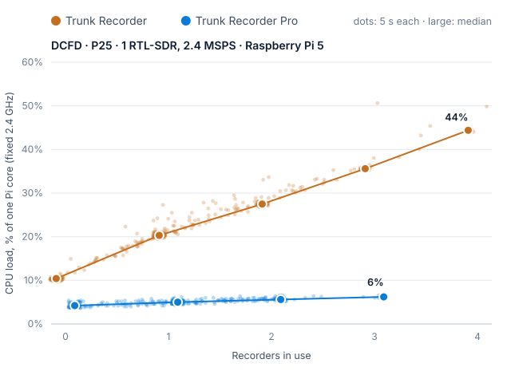
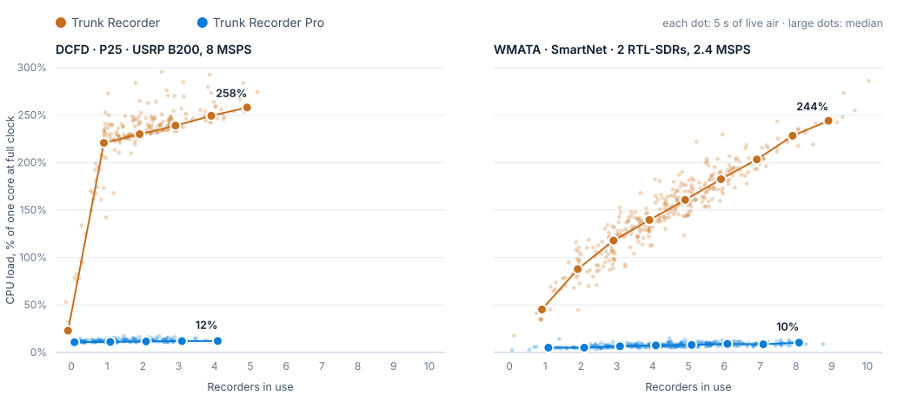

# Performance: Trunk Recorder Pro vs Trunk Recorder

Measured on 2 October 2026 on live air, on a Raspberry Pi 5 (Linux) and a
Mac mini (macOS): the same radios for both programs, one program running
at a time.

## Summary

- **Linux, Raspberry Pi 5:** Pro uses **4–6× less CPU** than Trunk Recorder
  while recording calls (5.0 % against 20.3 % of a core with one call, 6.2 %
  against 35.6 % with three). Each extra call costs Pro 0.7 points and Trunk
  Recorder 8.
- **macOS, Apple M4 Pro:** the gap is **17–20×**, because about three
  quarters of Trunk Recorder's CPU on macOS is the kernel contending over
  thread wake-ups ([Where Trunk Recorder's CPU goes](#where-trunk-recorders-cpu-goes));
  on Linux that share is about a fifth.

Pro's cost hardly depends on how many calls are being recorded: the radio's
spectrum is split into channels once by a shared FFT, so a recorder only
decodes its own narrow channel. In Trunk Recorder each recorder filters the
radio's whole sample stream for itself, through a chain of about 30 GNU
Radio blocks, each its own thread.

## Raspberry Pi 5 (Linux)

<picture>
  <source media="(prefers-color-scheme: dark)" srcset="img/cpu-vs-recorders-pi-dark.svg">
  
</picture>

Median CPU (% of one core, clock fixed at 2.4 GHz) over 5 s samples, the
recorder process itself:

| Recorders | Trunk Recorder | Pro | Ratio |
|---|---|---|---|
| 0 | 10.4 % | 4.2 % | 2.5× |
| 1 | 20.3 % | 5.0 % | 4.1× |
| 2 | 27.5 % | 5.6 % | 4.9× |
| 3 | 35.6 % | 6.2 % | 5.7× |
| 4 | 44.4 % | | |
| Average over the runs | 21.4 % | 5.0 % | 4.3× |
| Each extra recorder | +8.0 points | +0.7 points | |

| | Trunk Recorder | Pro |
|---|---|---|
| Kernel share of CPU time | 20 % | 2 % |
| Context switches | 23,000 / s | 98 / s |
| Memory | 137 MB | 56 MB |
| Control messages decoded (DCFD sends ~25 / s) | 21 / s | 95 % |
| Calls recorded, 2 × 15 min | 106 | 109 |

On top of that, Trunk Recorder runs ffmpeg after every call (two-pass
loudness normalisation and an M4A encode), another 9 % of a core on
average. Pro normalises loudness in-process and, with no upload plugin
configured, wasn't making M4As, so the table compares the recorder
processes alone.

**Setup:** Raspberry Pi Compute Module 5 (4 × Cortex-A76, 8 GB), Debian 12,
`performance` governor (2,400 MHz on every sample; peak 71 °C, never
throttled). One RTL-SDR (R820T) on DCFD at 858.3 MHz, 2.4 MSPS, −2 ppm, both
control channels in range (857.9875, 858.9875), CQPSK. Trunk Recorder at
1aac86c4 with Debian's GNU Radio 3.10.5, Release build, 8 digital
recorders; Pro at 6773e36. Gains differ: Trunk Recorder decoded almost
nothing at Pro's 28 dB (0–2 control messages / s) and runs at 49.6 dB, the
RTL's maximum; Pro at 28 dB. Same order as on the Mac: Trunk Recorder,
Pro, Trunk Recorder, Pro, 15 min each.

## Mac mini (macOS)

<picture>
  <source media="(prefers-color-scheme: dark)" srcset="img/cpu-vs-recorders-dark.svg">
  
</picture>

| | DCFD (P25, USRP B200, 8 MSPS) | WMATA (SmartNet, 2 RTL-SDRs, 2.4 MSPS each) |
|---|---|---|
| **Trunk Recorder**, average load | 201 % of a core | 149 % of a core |
| **Trunk Recorder Pro**, average load | 11.7 % | 7.6 % |
| Ratio | **17×** | **20×** |
| Trunk Recorder, each extra recorder | +11 points (+198 for the first) | +23 points |
| Pro, each extra recorder | +0.6 points | +0.7 points |
| Energy, Trunk Recorder / Pro | 5.4 W / 0.25 W | 1.1 W / 0.08 W |

"Load" is CPU work in cycles, as a share of one core at its full clock (see
[Clock speed](#clock-speed)). With the same number of calls being recorded,
Pro does 17–22× less work: at 2 recorders on DCFD 230 % vs 11.6 %, at 4 on
WMATA 140 % vs 7.4 %, at 8 on WMATA 228 % vs 10.3 %.

### Setup

- **Computer:** Mac mini, Apple M4 Pro (8 performance + 4 efficiency
  cores), 24 GB, macOS 26.5. Nothing else heavy ran during the tests (one-minute load average 2–5).
- **Trunk Recorder:** at 1aac86c4 (October 2026), GNU Radio
  3.10.12 from Homebrew, Release build (`-O3`), `softVocoder` on.
- **Trunk Recorder Pro:** 0.1.0 at 6773e36, release build.
- **DCFD** (DC Fire & EMS, P25 Phase 1 CQPSK simulcast): USRP B200 at 858 MHz,
  8 MSPS, gain 32, TX/RX antenna. Trunk Recorder with 8 digital recorders
  (its production config); Pro with its default of 32.
- **WMATA** (SmartNet with P25 voice): two RTL-SDRs at 496.4 and 490.25 MHz,
  2.4 MSPS each, gains 16.6 / 25.4. Trunk Recorder with 8 digital recorders
  per dongle.
- Both programs uploaded every call to OpenMHz throughout, as in
  production (Trunk Recorder in-process; Pro through its OpenMHz plugin).

Each system ran Trunk Recorder 15 min → Pro 15 min → Trunk Recorder 15 min →
Pro 15 min, so time-of-day traffic falls equally on both: 30 minutes of
live air per program per system, sampled every 5 s after a 45 s warm-up
(about 360 samples each).

### Method (macOS)

A sampler starts the program from the command line and every 5 s reads
the process's counters with `proc_pid_rusage` (`RUSAGE_INFO_V6`): CPU time (user and
system), CPU cycles and instructions (all cores, and on performance cores),
energy, memory. It adds the program's child processes: Trunk Recorder's
ffmpeg runs (waited for, so counted through the parent's child CPU time) and
Pro's plugin processes.

**Recorders in use** is averaged over each 5 s window: for Trunk Recorder
from its log ("Starting / Stopping … Recorder"), for Pro from the
`recording` count in its status messages (`/api/ws`, twice a second). Pro's
status connection costs it a little extra (it sends the spectrum to every
client); that is counted against Pro.

#### Clock speed

The M4 Pro changes clock speed with load, and macOS moves threads between
fast and efficient cores; neither can be fixed without root. A light load
runs on slow clocks and efficiency cores, so its "% CPU" in Activity Monitor
looks larger than the work it does. To compare like with like, **load** is
measured in CPU cycles, which don't depend on clock speed, divided by a
performance core at full clock (4.5 GHz). Child processes that exited
between samples report time, not cycles; that time is counted as if it ran
at full clock (which overstates it slightly, mostly against Trunk Recorder's
ffmpeg).

What the scheduler did:

| | DCFD TR | DCFD Pro | WMATA TR | WMATA Pro |
|---|---|---|---|---|
| CPU time, as Activity Monitor shows it | 252 % | 22 % | 263 % | 16 % |
| …of it in the kernel | 201 % | 14 % | 219 % | 1 % |
| Average clock while running | 3.6 GHz | 2.3 GHz | 2.5 GHz | 1.9 GHz |
| Cycles on performance cores | 100 % | 99 % | 75 % | 30 % |
| Load (cycles, % of a core at 4.5 GHz) | 201 % | 11.7 % | 149 % | 7.6 % |
| Energy | 5.4 W | 0.25 W | 1.1 W | 0.08 W |
| Memory | 21 MB | 115 MB | 35 MB | 79 MB |

By CPU time the ratios are smaller (11× and 17×) because Pro runs mostly
on slow clocks. Pro uses more memory: it keeps one second of every radio's
samples for pre-roll (8 MSPS × 8 bytes = 64 MB for the USRP).

#### Results by recorders in use

Median load over the 5 s samples at each count (counts with at least 3
samples):

| Recorders | DCFD TR | DCFD Pro | WMATA TR | WMATA Pro |
|---|---|---|---|---|
| 0 | 23 % | 10.8 % | | |
| 1 | 221 % | 11.1 % | 45 % | 5.0 % |
| 2 | 230 % | 11.6 % | 88 % | 5.0 % |
| 3 | 239 % | 12.0 % | 118 % | 6.5 % |
| 4 | 249 % | 12.1 % | 140 % | 7.4 % |
| 5 | 258 % | | 161 % | 8.0 % |
| 6 | | | 183 % | 9.1 % |
| 7 | | | 203 % | 8.6 % |
| 8 | | | 228 % | 10.3 % |
| 9 | | | 244 % | |

DCFD's traffic peaked at 4–7 calls inside the USRP's 8 MHz, WMATA's at
9–11. Trunk Recorder held calls a little longer on DCFD (1.8 recorders
in use on average against Pro's 1.2: `conversationMode` keeps a recorder
between transmissions), which is why the comparison is made at the same
number of recorders rather than over the runs as a whole.

#### Reception

Neither program was starved: the USRP delivered 8.000 MSPS and the RTL-SDRs
2.4 MSPS throughout. Pro dropped 48,884 samples (6 ms) once in one DCFD run
and none otherwise; Trunk Recorder logged no overflows. Pro decoded 99.8 %
of DCFD's control messages (74,856 good, 119 bad) and 99.99 % of WMATA's.

## Where Trunk Recorder's CPU goes

On DCFD, Trunk Recorder uses 38 % CPU time with no call being recorded and
280 % with one; each further recorder adds only ~9 points. On WMATA, each
recorder adds ~23 points. In both, 75–85 % of the CPU time is spent in the
kernel, not in the DSP. Profiling DCFD (`top` for context switches and
system calls, `sample` for stacks, idle against exactly one recorder):

| | Idle | One recorder |
|---|---|---|
| CPU time | 38 % | 282 % |
| Context switches | 23,000 / s | 215,000 / s |
| BSD system calls | 56,000 / s | 650,000 / s |
| Threads | 258 | 258 |

The DSP itself (FFTW, VOLK, UHD's sample conversion) barely registers in
the stacks; the busy frames are `__psynch_cvwait` / `__psynch_cvsignal`,
condition variables waking and sleeping threads. The busiest thread is the
source's recorder selector (`gr::blocks::selector`, Trunk Recorder's
`gr_blocks/selector_impl.cc`), which spends its time signalling; next are
the first block of **every** recorder (the FFT filter inside each
freq-xlating channelizer), idle ones included. That has two causes in GNU
Radio's thread-per-block scheduler:

1. **A block wakes the readers of all its outputs.** After each `work()`
   call, `tpb_detail::notify_downstream()` signals every reader of every
   output port, whether or not anything was produced on that port. The
   selector has one output per recorder, so every selector call wakes all
   of them, idle ones included.
2. **An enabled port makes the selector run in small pieces.** Once a
   recorder is enabled, each selector call is limited by the free space in
   that recorder's input buffer, which the decimating FFT filter frees a
   little at a time.

### Tried: making the selector move larger chunks

`recorder_selector->set_min_noutput_items(4096)` and
`set_min_output_buffer(port, 16384)` on each selector port, in
`Source::attach_selector()` (switched by an environment variable, so both
arms are the same binary). WMATA on two spare RTL-SDRs (91 and 200, same
tuning, rate and gains as above, no upload), baseline and batched
alternating, 30 min each:

| | Baseline | Batched |
|---|---|---|
| Context switches | 106,000 / s | **33,000 / s** (−69 %) |
| BSD system calls | 314,000 / s | **94,000 / s** (−70 %) |
| Load at 2 / 4 / 6 recorders | 71 / 123 / 174 % | 82 / 127 / 175 % |
| Each extra recorder | +25 points | +24 points |
| Kernel share of CPU time | 80 % | 80 % |
| Decode errors per second of audio | 45.0 | 43.9 |

It did what it was meant to (a third of the wake-ups and system calls),
but the load per recorder and the reception stayed the same.

### Kernel stacks

`sudo spindump <pid> 10` records kernel stacks too. On-CPU samples of
Trunk Recorder, 10 s each, while recording 2 calls:

| | DCFD (USRP, 258 threads) | WMATA (2 RTLs, 478 threads) |
|---|---|---|
| **Kernel: spinning on the pthread wait-queue lock** (`_psynch_cvwait` → `ksyn_wqfind` / `ksyn_wqrelease`) | **74 %** | **72 %** |
| Kernel: other | 18 % | 17 % |
| User: GNU Radio scheduler, locks, glue | 4 % | 6 % |
| **User: the DSP itself** (block `work()`, FFTW, VOLK) | **4 %** | **5 %** |

Three quarters of Trunk Recorder's CPU on macOS is threads spinning on the
kernel lock that guards condition-variable wait queues; the signal
processing is about 5 %. Each wake-up or sleep of a GNU Radio thread
(`__psynch_cvwait` / `__psynch_cvsignal`) looks up its wait queue under
that lock, and when many threads do so at once they spin.

- **DCFD:** the selector and the first block of every recorder dominate. In
  the sample, the 6 idle recorders' FFT filters (1–5 of 1000 samples in
  `work()`) used 1.4 cores between them, the selector 0.66, and the
  remaining ~240 threads under 0.2 together. Each selector call wakes all 9
  filters at once (the fan-out above), and they collide on the lock.
- **WMATA:** spread thinly over all 478 threads (two selectors 2.5 s, 17
  FFT filters 5.1 s, the rest ~6 s). Batching the selector removed only
  one source of the wake-ups, so the spinning carried on in the rest of
  the chains.

As far as we can tell from xnu's source, that lock is shared by the whole
system rather than per process, so one busy Trunk Recorder slows another;
the production DCFD instance ran throughout the WMATA A/B above.

Linux confirms it: on the Raspberry Pi, where the same waits are futexes
in hashed buckets, Trunk Recorder's kernel share is 20 % rather than 80 %,
and Pro's lead shrinks from 17–20× to 4–6×. What's left there is each
recorder filtering the whole sample stream for itself (+8 points per
recorder against Pro's +0.7).

### Next steps

- **On macOS, cut the wake-ups that collide:** skip output ports with
  nothing new in GNU Radio's `tpb_detail::notify_downstream()`, so idle
  recorders aren't woken (on DCFD, ~1.4 of ~3 cores); and fewer threads per
  recorder (merge the chain's simple float blocks), so there are fewer
  threads to contend.
- Repeat the selector A/B with nothing else running, to rule out the
  production instance's contention.
